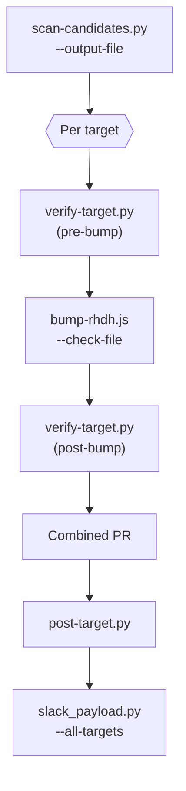

# CVE medic workflow

One combined PR per **target** per stream per run. Run commands from this skill
directory. Do not read script source unless a command fails.

**Agent cost rules**

- Write large JSON to files (`--output-file`, `--items-out`); never paste scan,
  check, bump, or Slack payloads into chat — summarize stderr one-liners only.
- Prefer batch scripts below over per-package loops.
- Skip `/prose-editing` in dry-run; live runs only when `format-cve-pr.py`
  output needs a tone pass.
- Do not invoke `/rhdh-jira-api` for scans.

**Out of scope — stop and report manual-review**

CVE medic only runs `yarn up -R` (via `bump-rhdh.js` / `bump-workspace-packages.js`).
When that leaves vulnerable versions, **do not** investigate or fix further:

- No manual `yarn up` on parents (`express`, `body-parser`, `swagger-ui-react`, …)
- No `yarn set resolution`, `resolutions`, patches, or major-pin workarounds
- No extra `bump-yarn-ancestors.js` / `bump-package-ancestors.js` unless the user
  explicitly asks
- No `yarn install` debugging, lockfile surgery, or dependency-tree forensics beyond
  what `collect-items.py` / `format-cve-pr.py` already emit (`pin_analysis`,
  Partial leftovers table)
- No “update express-openapi-validator” / “resolve pins” proposals — Slack digest
  `manual-review` is the handoff

**Partial success is normal.** Open the combined PR with every package `bump-rhdh.js`
moved; leftover vulnerable versions (`qs`, `js-yaml`, …) go in the digest and PR
**Partial leftovers** section only. List a package under **Fully fixed** only when
it is not vulnerable in every yarn root that installs it (repo root and
`dynamic-plugins/` for rhdh).

**Bump package list.** Pass **all** non-skipped scan packages to the bump script
(use `packages-from-scan.py`). Never pass only the pre-check `safe: false` subset —
that skips packages that still need a lockfile refresh.

**PR is mandatory** when `yarn.lock` and/or `dynamic-plugins/yarn.lock` changed
(live run): `/mutation-gate` → commit **both** lockfiles if changed → push →
`gh pr create`. Do not end the run with a summary only. No lockfile diff → report
why (dry-run, or nothing to bump).

Use `/rhdh-context` for checkout paths. Missing checkout → skip that target.

## Targets

| Stream | Targets |
|--------|---------|
| 1.9 | `rhdh`, `orchestrator` |
| 1.10+ | `rhdh`, `orchestrator`, `lightspeed` |

| Target | Repo | Release branch | Yarn cwd |
|--------|------|----------------|----------|
| `rhdh` | `redhat-developer/rhdh` | `release-X.Y` | rhdh root |
| `orchestrator` | `redhat-developer/rhdh-plugins` | `release-X.Y/orchestrator` | `workspaces/orchestrator/` |
| `lightspeed` | `redhat-developer/rhdh-plugins` | `release-X.Y/lightspeed` | `workspaces/lightspeed/` |

Workspace branches: `release-X.Y/{plugin}` only ([#4173](https://github.com/redhat-developer/rhdh-plugins/pull/4173)).
Missing branch → stop target, ask human. Scope: `rhdh/rhdh-hub-rhel9` only.

## Flow



Script list: `SKILL.md`. Workspace tools from `/plugins-package-impact`.

## Options

| Option | Effect |
|---|---|
| `--skip-jira` | No Jira writes; digest marks Fix Version skipped |
| `--repo` | **PR base repo** for `rhdh` (default `redhat-developer/rhdh`). Accepts `owner/name` or `https://github.com/...`. Use `forge-pr.py` — never hard-code upstream. |
| `--plugins-repo` | PR base repo for `orchestrator` / `lightspeed` (default `redhat-developer/rhdh-plugins`) |
| `--workspace` | One target only |

## Step 1 — Scan (one call)

```bash
python scripts/scan-candidates.py --stream 1.9 \
  --output-file /tmp/cve-scan.json --compact
```

`--stream` adds `targets[]` and `fix_version` to the JSON (no separate
`fix-version-from-env.py` call). Groups with `skip_reason` → manual-review.

## Step 2 — Verify, bump, verify (per target)

Checkout release branch. **Pre-bump verify** filters already-safe packages:

```bash
python scripts/verify-target.py \
  --scan-file /tmp/cve-scan.json --target rhdh \
  --rhdh-root <rhdh> \
  --output-file /tmp/check-pre-rhdh.json --compact
```

Bump **all** scan packages (not only pre-check failures). `--check-file` skips
already-safe installs only:

```bash
PKGS=$(python scripts/packages-from-scan.py --scan-file /tmp/cve-scan.json)
node scripts/bump-rhdh.js --repo-root <rhdh> \
  --check-file /tmp/check-pre-rhdh.json \
  $PKGS --json > /tmp/bump-rhdh.json
```

Commit `yarn.lock` and `dynamic-plugins/yarn.lock` when either changed.

**Post-bump verify** (for PR body + digest):

```bash
python scripts/verify-target.py \
  --scan-file /tmp/cve-scan.json --target rhdh \
  --rhdh-root <rhdh> \
  --output-file /tmp/check-rhdh.json --compact
```

Workspaces: same pattern with `--plugins-root`; use
`bump-workspace-packages.js` (no `--check-file` yet — filter package list from
pre-check JSON before calling).

## Step 3 — PR and Jira

One PR per (target, stream). Jira: prod + fully patched + SLA >= 10d → Review +
Fix Version. Non-prod → bump in PR, digest says close **Not a Bug**. SLA < 10d
→ PR only, `fix_version` null.

| Target | Fully patched + SLA >= 10d | Non-prod (plugins only) |
|--------|------------------------------|-------------------------|
| `rhdh` | Review + Fix Version | — |
| plugins | Review + Fix Version (`PLUGIN_PROD`) | Not a Bug |

Fork → upstream PR. Branch `cve-medic-<target>-<base>`. Subject
`[<base>] chore(deps): CVE patch bump (<N> packages)`.

**Live:** `/mutation-gate` → commit, push, `gh pr create`. Resolve PR args with
`forge-pr.py` (honours `--repo` / `--plugins-repo`):

```bash
python scripts/forge-pr.py --target rhdh --stream 1.9 \
  --checkout <rhdh> --repo <from invocation --repo> \
  --bump-file /tmp/bump-rhdh.json --strict
```

Use `pr_repo`, `head`, and `base` from the JSON. Stage every path in
`required_lockfiles` before `--strict` passes (`yarn.lock` and
`dynamic-plugins/yarn.lock` when bump touched both roots). Example:

```bash
FORGE=$(python scripts/forge-pr.py --target rhdh --stream 1.9 \
  --checkout <rhdh> --repo <from invocation --repo> \
  --bump-file /tmp/bump-rhdh.json --strict)
REPO=$(echo "$FORGE" | python3 -c 'import json,sys; print(json.load(sys.stdin)["pr_repo"])')
HEAD=$(echo "$FORGE" | python3 -c 'import json,sys; print(json.load(sys.stdin)["head"])')
BASE=$(echo "$FORGE" | python3 -c 'import json,sys; print(json.load(sys.stdin)["base"])')
TITLE=$(python scripts/format-cve-pr.py ... --title)
gh pr create --repo "$REPO" --head "$HEAD" --base "$BASE" \
  --title "$TITLE" --body-file /tmp/pr-rhdh.md
```

`/rhdh-jira-update` for prod tickets only (unless `--skip-jira`). **Dry-run:**
revert lockfiles; no writes.

## Step 4 — Digest (batch)

Per target after bump + verify:

```bash
python scripts/post-target.py \
  --scan-file /tmp/cve-scan.json --stream 1.9 --target rhdh \
  --bump-file /tmp/bump-rhdh.json --check-file /tmp/check-rhdh.json \
  --fix-version "$(jq -r .fix_version /tmp/cve-scan.json)" \
  --pr-url "https://github.com/..." \
  --items-out /tmp/cve-items.json \
  --pr-body-out /tmp/pr-rhdh.md
```

Repeat per target. One Slack build for all targets:

```bash
python scripts/slack_payload.py --items-file /tmp/cve-items.json \
  --all-targets --output-dir /tmp/slack
./scripts/slack-notify.sh --payload-file /tmp/slack/slack-rhdh.json
```

`slack-notify.sh` reads `RHDH_CVE_SLACK_WEBHOOK` from `~/.config/rhdh-skills/cve-medic.env`
(via `fix-version-from-env.py`), or Keychain `slack-cve-webhook`. Missing → skip
Slack and print payload.

Item kinds: `patched`, `already-safe`, `manual-review` (non-prod bump:
`jira_action=close_not_a_bug`).

## Dry-run

Same pipeline, no `git commit`/`push`/`gh pr create`/Slack POST/Jira writes.
Allowed: `verify-target.py`, `post-target.py`, `slack_payload.py`,
`format-cve-pr.py`. Never print `JIRA_API_TOKEN`.

## Reference

`references/check-cve.md` — package-name matching and `yarn why -R` parsing.
Single-package debugging: `check-cve.py` still accepts `--why-file` /
`--advisory-file`.
